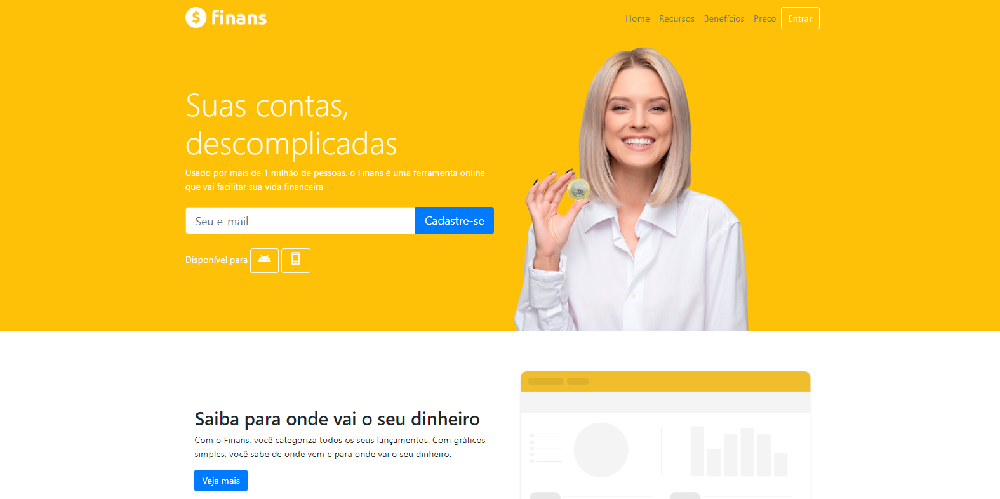

# Finans 💰

You can access it with this [link.](https://marvelous-monstera-96229f.netlify.app/)
# 💻 About the project 
The Finans project was developed a long time ago, has a static and visually pleasing layout. With harmonious graphics and colors, I created this project in order to improve my skills in Bootstrap technology.
# 🚀 Technologies 
Finans was developed using the following technologies:

- HTML5
- CSS3
- BootStrap
- Netlify
# 🛠️ How to install the project and run it on your machine
To install and run the project, follow the steps below:

- Clone this repository to your local environment:
```bash
git clone https://github.com/devpdro/project-finans.git
```
- Navigate to the project directory:
```bash
cd project-finans
```
